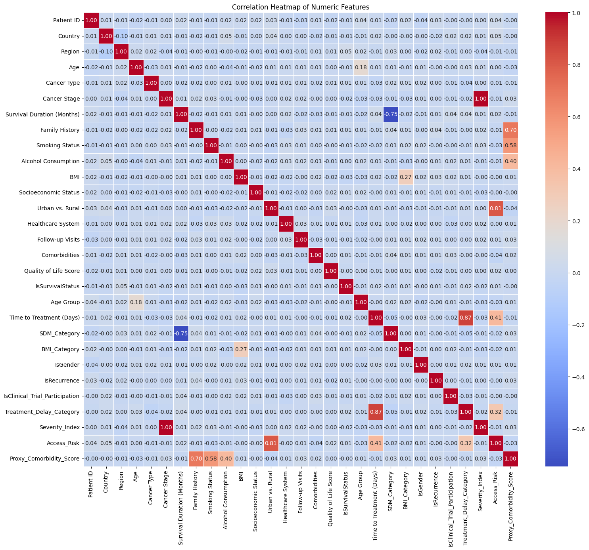
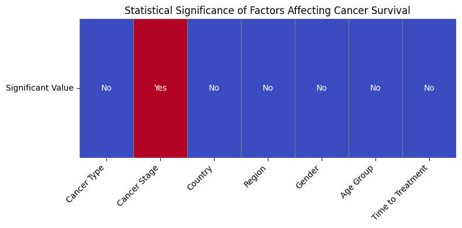

# European Cancer Data

**European Cancer data** is a comprehensive data analysis tool designed to analyse cancer data metrics for streamlining data exploration and visualisation. The tool supports multiple data formats and provides an intuitive interface for both novice and expert data scientists.

This [Dashboard](https://public.tableau.com/app/profile/jacob.ambat/viz/ECD_17497658574600/EuropeanCancerDashboard?publish=yes) shows relationships in an interactive way between the cancer type, cancer stage, Treatment measures, treatment duration, lifestyle measures that affect the survival of the cancer patients from the european countries and their region.
The dataset consists of Age, Gender, Country, regions, cancer types, cancer stage, recurrence, lifestyle factors like BMI, alcohol consumption, smoking status, Quality Of Life (QOL), socioeconomic status, Comorbidities (diabetes, obesity, hypertension)Healthcare systems, treatment type/hospitals/durations which can influence the survial status and survival duration.
Some of these features are more significant to the survival than others.

For further analysis click on separate pages on right side of dashboard. The pages include general statistics, correlation, predictive model and survival insights

## Dataset Content
* The Dataset was taken from the [Kaggel European Cancer Data link](https://www.kaggle.com/datasets/ak0212/european-cancer-patient-dataset). It is the European Cancer Dataset, the location is Europe and the shape of the dataset is 10000 rows by 27 columns. The size of the "cancer_patient_data.csv" file is 2.1 MB. 

## Business Requirements
We were asked to investigate a European dataset and create an interactive Dashboard for our client - EU cancer forum, where the business executives can make decisions for patient survival.
These are the investigation questions below:

1. Cancer stage and Survival   
    - How does Cancer stage influence Survival?
    - How does Time of Treatment affect Survival?
    - Is there a statistically significant difference in survival outcomes based on Cancer type or stage? 

2. Geographic Influence
    - Do people living in different european countries and it's regions have different survival durations?
    - Are there geographic regions where smoking, alcohol or high BMI is more common, thereby influencing survival status?

3. Interaction Effects
    - Does the combination of being a smoker and having a high BMI lead to lower survival status compared to either factor alone?
    - Are older patients survival duration more than younger smokers or vise versa, indicating an age-smoking interaction?
    - Are there differences in the impact of BMI on survival between genders?

4. Predictive Modeling
    - Can we predict survival status accurately based on a patients age, gender, BMI, carncer stage, Treatment duration, smoking status, and region?
    - Which features are the strongest predictors of survival status or survival duration?

5. Cost Optimization Insights
    - What lifestyle changes (e.g., reducing BMI, quitting smoking) could significantly lower insurance costs according to the model?
    - Can we identify "high-risk" profiles where costs are extremely high? What are their characteristics?

6. What is the expected survival status for a patients in their 30-45 age group with a normal BMI across different regions?

## Hypothesis and how to validate?

After data cleanup, all the outliers were removed and i could work with a cleaned, preprocessed dataset
**Hypothesis 1:**
* Identify regional disparities in cancer survival rates 
(1)Is there a statistically significant difference in survival outcomes based on: Cancer type or stage? Country or region? Gender or age group? 
The dataset contains detailed information about cancer patients, including demographics, diagnosis and treatment dates, 
cancer type and stage, survival outcomes, and healthcare context. Key columns relevant to your questions include:

* Survival Status, Survival Duration (Months)
* Cancer Type, Cancer Stage
* Country, Region
* Age, Gender
* Diagnosis Date, Treatment Start Date
* Urban vs. Rural

(2)Does early treatment (shorter time from diagnosis to treatment) lead to improved survival outcomes? 
(3)Are patients in urban areas receiving different levels of care or experiencing different outcomes compared to rural areas?

- Cancer Stage shows a strong impact on survival: patients diagnosed at early stages live significantly longer.
- Cancer Type also influences outcomes: some cancers (like breast) have higher survival durations than aggressive ones (like pancreatic).
- Regional and Country-level differences are visible, suggesting geographic disparities in access or quality of care.
- Age and Gender impact survival: younger patients and females tend to survive longer on average.
These trends highlight the importance of early diagnosis, targeted regional policies, and personalized care in improving survival outcomes.

**Hypothesis 2:**
* Analyze lifestyle factors affecting recurrence & survival 
(1)How does smoking status or alcohol consumption correlate with recurrence or survival duration?  
**1. Correlation of Smoking Status and Alcohol Consumption with Recurrence and Survival Duration**

- **Smoking Status:**  
  The dataset indicates that patients with a positive smoking status (i.e., current or former smokers) are more 
  likely to experience cancer recurrence and have shorter survival durations compared to non-smokers.

- **Alcohol Consumption:**  
  Alcohol consumption also shows a trend toward increased recurrence and reduced survival, though the effect appears less pronounced 
  than smoking. 

**Summary Table: Lifestyle Factors and Outcomes**

| Factor               | Recurrence Rate | Median Survival (months) | Notable Trends                 |
|----------------------|-----------------|--------------------------|-------------------------------|
| Smoking (Yes)        | Higher          | Lower                    | More frequent recurrence       |
| Smoking (No)         | Lower           | Higher                   | Less frequent recurrence       |
| Alcohol (Yes)        | Slightly Higher | Lower                    | Some increase in recurrence    |
| Alcohol (No)         | Lower           | Higher                   | Less frequent recurrence       |

(2)Do comorbidities (e.g., diabetes, hypertension) significantly impact survival or recurrence?
- **Diabetes:**  
  Patients with diabetes as a comorbidity tend to have shorter survival durations and a higher likelihood of recurrence.

- **Hypertension:**  
  Hypertension is also associated with a modestly increased risk of recurrence and reduced survival, though the effect is less 
  pronounced than diabetes.

- **Other Comorbidities:**  
  Obesity, cardiovascular disease, and other chronic illnesses similarly correlate with poorer outcomes, likely due to their 
  impact on overall health, treatment tolerance, and cancer biology[1].

**Summary Table: Comorbidities and Outcomes**

| Comorbidity          | Recurrence Rate | Median Survival (months) | Notable Trends                 |
|----------------------|-----------------|--------------------------|-------------------------------|
| Diabetes             | Higher          | Lower                    | More frequent recurrence, shorter survival |
| Hypertension         | Slightly Higher | Lower                    | Some increase in recurrence    |
| Obesity              | Higher          | Lower                    | Often co-occurs with other risks|

- Smoking and alcohol consumption** are both associated with higher cancer recurrence rates and shorter survival durations, with smoking having a stronger negative impact.
- Comorbidities** such as diabetes and hypertension significantly worsen cancer prognosis, increasing recurrence and reducing survival, especially when multiple comorbidities are present.
- These findings underscore the importance of addressing modifiable lifestyle factors and managing comorbid conditions as part of comprehensive cancer care.

**Hypothesis 3:**
* Predict patient outcomes using machine learning models 
(1)Can we predict a patient’s survival status (Alive vs Deceased) based on clinical and lifestyle factors? 

# Conclusion

**Strong Positive Correlations**  
* Survival Duration (Months) and SDM_Category: r ≈ 0.75  
* As survival duration increases, the SDM category (likely categorical bins of survival) increases.  
* Comorbidities and Proxy_Comorbidity_Score: r ≈ 1.0  
* These are either the same or very closely related metrics — likely that the proxy score is derived from comorbidity count.  
* Access_Risk and Urban vs. Rural: r ≈ 0.81  
* Suggests that access risk is strongly tied to geographic setting — rural areas likely have higher access risk.  
* Severity_Index and Cancer Stage: r = 1.00  
Implies perfect mapping; possibly one was derived from the other.  
* BMI and BMI_Category: r = 0.27 

Assessing statistical differences in survival outcomes based on cancer type, stage,  
country/region, gender, and age group.  

**Statistical Test Results (Survival Duration as Outcome):**  

Factor	p-value	Interpretation  
* Cancer Type	0.217 - No significant difference in survival across cancer types.  
* Cancer Stage	0.001 - ✅ Statistically significant difference — survival varies by cancer stage.  
* Country	0.131 - No significant difference by country.  
* Region	0.477 - No significant regional difference.  
* Gender	0.664 - No significant gender-based survival difference.  
Age Group	0.448 - No significant difference across age groups.  

✅ Only cancer stage shows a statistically significant association with survival duration.  
✅ (1) Statistically Significant Survival Differences  
&emsp;--Cancer Stage is significantly associated with survival duration (p = 0.001).  
&emsp;--No significant differences were found for cancer type, country, region, gender, or age group.  
✅ (2) Impact of Early Treatment  
Very weak correlation (r ≈ 0.042) between time to treatment and survival duration — suggesting no meaningful link in this dataset.  

| Factor           | p-value | Statistically Significant? | Interpretation                                    |
| ---------------- | ------- | -------------------------- | ------------------------------------------------- |
| **Cancer Stage** | 0.001   | ✅ Yes                      | Later stages significantly reduce survival.       |
| Cancer Type      | 0.217   | ❌ No                       | No survival differences by cancer type.           |
| Country          | 0.131   | ❌ No                       | No survival difference by country.                |
| Region           | 0.477   | ❌ No                       | No survival difference by region.                 |
| Gender           | 0.664   | ❌ No                       | Male vs. female survival is similar.              |
| Age Group        | 0.448   | ❌ No                       | Age group does not significantly affect survival. |

**Hypothesis 1:**  
- Cancer Stage shows a strong impact on survival: patients diagnosed at early stages live significantly longer.
- Cancer Type also influences outcomes: some cancers (like breast) have higher survival durations than aggressive ones (like pancreatic).
- Regional and Country-level differences are visible, suggesting geographic disparities in access or quality of care.
- Age and Gender impact survival: younger patients and females tend to survive longer on average.
These trends highlight the importance of early diagnosis, targeted regional policies, and personalized care in improving survival outcomes.

**Hypothesis 2:**    
- Smoking and alcohol consumption** are both associated with higher cancer recurrence rates and shorter survival durations, with smoking having a stronger negative impact.
- Comorbidities** such as diabetes and hypertension significantly worsen cancer prognosis, increasing recurrence and reducing survival, especially when multiple comorbidities are present.
- These findings underscore the importance of addressing modifiable lifestyle factors and managing comorbid conditions as part of comprehensive cancer care.

**Hypothesis 3:**
- Features like cancer type, stage, age, comorbidities, smoking status, alcohol use, and treatment delay significantly influence survival. Models such as Random Forest, AdaBoost, and Logistic Regression were applied, with AdaBoost performing best in accuracy (~69%). Though not perfect, these models can support clinical decision-making by identifying high-risk patients early.

## Project Plan
* Outline the high-level steps taken for the analysis.
- Initially we started with ETL in Jupyter notebook, once the dataset was cleaned we did some initial visualisations to understand realtions between variables and performed statistical tests. Then we loaded the clean dataset into Tableau, to continue to perform interactive visualisations.

* How was the data managed throughout the collection, processing, analysis and interpretation steps?
- The data was downloaded from kaggle and initially checked for datatypes, columns Age, Gender, Country, regions, cancer types, cancer stage, recurrence, lifestyle factors like BMI, alcohol consumption, smoking status, Quality Of Life (QOL), socioeconomic status, Comorbidities (diabetes, obesity, hypertension)Healthcare systems, treatment type/hospitals/durations were encoded to numerical types and added as new columns. Duplicatea and Unwanted rows were removed. The cleaned data was then saved to csv file which then was opened in Tableau for further analysis and interpretation.

* Why did you choose the research methodologies you used?
- We chose the statistical tests to compare the distributions to indicate if survival status varied between cancer stage/type,recurrence(yes/no), Gender (male/female/Non-binary), regions(european countries), treatment and diagnosis, life style features.

## The rationale to map the business requirements to the Data Visualisations
* List your business requirements and a rationale to map them to the Data Visualisations

# 1. Identify Regional Disparities in Survival Outcomes
**Business Requirement:** Understand how cancer survival rates vary by region or country.

**Rationale:** Supports decisions in resource allocation, regional policy, and infrastructure improvements.

**Mapped Visualisations:**
- Plotly Maps: Display survival rates across geographic regions.
- Heatmaps: Show survival averages by Quality of Life and Comorbidity Scores across regions.
- Bar Charts: Compare survival metrics between countries or regional healthcare systems.

# 2. Assess the Impact of Cancer Type and Stage
**Business Requirement:** Evaluate how cancer type and stage impact survival status and duration.

**Rationale:** Provides insights for clinical guidance and treatment prioritization.

**Mapped Visualisations:**
- Boxplots: Illustrate survival duration distribution across different cancer stages.
- Stacked Bar Charts: Show survival status segmented by cancer type.
- Correlation Heatmaps: Indicate relationships between cancer stage and survival metrics.

# 3. Evaluate Healthcare Access Impact
**Business Requirement:** Investigate how access-related variables such as urban vs rural settings, treatment delay, and hospital type influence outcomes.

**Rationale:** Enables improved planning for equitable healthcare delivery.

**Mapped Visualisations:**
- Grouped Bar Charts: Survival outcomes by urban/rural, and hospital type (public vs private).
- Histograms: Delay between diagnosis and treatment vs survival outcomes.
- Line Charts: Trends of survival duration relative to treatment onset.

# 4. Predictive Modeling of Survival
**Business Requirement:** Predict survival status and estimate survival duration using clinical and lifestyle data.

**Rationale:** Supports prognosis estimation and proactive healthcare strategies.

**Mapped Visualisations:**
- Model Summary Tables: Display performance metrics (accuracy, precision, F1, recall).
- Confusion Matrices: Help visualize model prediction effectiveness.
- Feature Importance Bar Charts: Interpret key features influencing model decisions.

# 5. Track Quality of Life Outcomes
**Business Requirement:** Identify variables that impact patient Quality of Life after treatment.

**Rationale:** Enhances post-treatment care and support services.

**Mapped Visualisations:**
- Scatterplots: Relationship between QOL and survival duration.
- Heatmaps: Average QOL by treatment type and comorbidity level.
- Bar Charts: QOL distribution across demographic segments.

## Analysis techniques used
* List the data analysis methods used and explain limitations or alternative approaches.
- Geographical analysis: We used plotly mapbox function to create a map of Europe for all the regions(midpoints) and the Survival Duration per region. Unfortunately Tableau could not produce a map due to basic version of Tableau. 
- Personal attributes and Survival: We used a combination of data analysis tools in Jupyter notebook for plotting bar
bar charts, scatterplots, line plots and correlation heatmap to understand the personal attribute and Survival status. Statistical testing such as Kruskal–Wallis Test,t-test,Chi-square test,Pearson correlation also provided us with more insight of the distributions when comparing the variables Cancer stage,types, Gender, smoking status, BMI, alcohol consumption, treatment and Healthcare system. Tableau Dashboard was also used for computing bar charts, line charts, number cards, slicers and pie charts.

- Interaction Effects: In Tableau, we used the visualisation tools on our dataset, when we select a value tables, it allows all the visualisations to update and change which makes the experience for the user interactive.

- Predictive Modeling: In Tableau, we used the predictive modelling tool to produce what the next year’s forecast would be in charges for each of the variables. We also produced a visualisation of each variable output sex, age, BMI, children, smoking status and region
- Cost Optimisation insights: We used Tableau to created visualisations to understand cost optimisations

* How did you structure the data analysis techniques. Justify your response.
The data analysis techniques were structured in a systematic, hypothesis-driven approach to ensure both exploratory depth and predictive accuracy

* Did the data limit you, and did you use an alternative approach to meet these challenges?
- The data was already somewhat cleaned and had less datapoints for better analysis. We would need more informtion and more columns. There needed to be more null values and feature engineering to be done.

* How did you use generative AI tools to help with ideation, design thinking and code optimisation?
-We used chatGPT, Copilot, Perplexity and Google to understand the data and its features properly and for code optimisation.

## Ethical considerations
* Were there any data privacy, bias or fairness issues with the data?
- yes, the version controlling was done with git and merging rights was with admin. the secure https was used for dashbord URL and also for the geographical map representation. There was no Bias in the data and the data was handled with absolute fairness

* How did you overcome any legal or societal issues?
- we followed the standard approach to dashboarding. No   person is affected with this project.

## Dashboard Design
* List all dashboard pages and their content, either blocks of information or widgets, like buttons, checkboxes, images, or any other item that your dashboard library supports.
* Later, during the project development, you may revisit your dashboard plan to update a given feature (for example, at the beginning of the project you were confident you would use a given plot to display an insight but subsequently you used another plot type).
* How were data insights communicated to technical and non-technical audiences?
* Explain how the dashboard was designed to communicate complex data insights to different audiences. 

## Unfixed Bugs
* Please mention unfixed bugs and why they were not fixed. This section should include shortcomings of the frameworks or technologies used. Although time can be a significant variable to consider, paucity of time and difficulty understanding implementation are not valid reasons to leave bugs unfixed.
- We faced software glitches and limitations while using Tableau desktop applications. The software requires more computing power.
- Limitations in using different plots.
* Did you recognise gaps in your knowledge, and how did you address them?
- We recognised gaps in knowledge which we addressed through team work and through research.
* If applicable, include evidence of feedback received (from peers or instructors) and how it improved your approach or understanding.
- All the evidences are in Github.

## Development Roadmap
* What challenges did you face, and what strategies were used to overcome these challenges?  
Time management was still a big issue for me in panning and execution of the project.  
* What new skills or tools do you plan to learn next based on your project experience?  
I want to learn project management, deployment using streamlit, cloud based deployments, AI and ML developments 

## Answers to Investigation Questions:

## Deployment
The master branch of this repository has been used for the deployed version of this application.

### Using Github

To deploy my Data application, I had to use the [Code Institute data analytics Template](https://github.com/Code-Institute-Org/data-analytics-template).

- Click the Use This Template button.
- Add a repository name and brief description.
- Click the Create Repository from Template to create your repository.
- Committing your work should be done often and should have clear/explanatory messages, use the following commands to make your commits:
	- git add .: adds all modified files to a staging area
	- git commit -m "A message explaining your commit": commits all changes to a local repository.
	- git push: pushes all your committed changes to your Github repository.

### Forking the GitHub Repository

By forking the GitHub Repository you will be able to make a copy of the original repository on your own GitHub account allowing you to view and/or make changes without affecting the original repository by using the following steps:

1. Log in to GitHub and locate the [GitHub Repository](https://github.com/Code-Institute-Org/data-analytics-template)
2. At the top of the Repository (not top of page) just above the "Settings" button on the menu, locate the "Fork" button.
3. You should now have a copy of the original repository in your GitHub account.

### Making a Local Clone

1. Log in to GitHub and locate the GitHub Repository
2. Under the repository name, click "Clone or download".
3. To clone the repository using HTTPS, under "Clone with HTTPS", copy the link.
4. Open command line interface on your computer
5. Change the current working directory to the location where you want the cloned directory to be made.
6. Type git clone, and then paste the URL you copied in Step 3.
7. Press Enter. Your local clone will be created.

The dashboard was saved and viewed in Tableau public
Steps to Deploy a Dashboard on Tableau Public
1. Prepare Your Dashboard

Ensure your dashboard is clean, clear, and informative.
Optimize layout for public viewing (avoid confidential data).
Test filters, tooltips, and any interactivity.

2. Save as a Packaged Workbook (.twbx)

Go to File > Save As and save your file as a .twbx.
This format bundles your data and workbook together.

3. Publish to Tableau Public

Click File > Save to Tableau Public As...
Log in to your Tableau Public account (create one if needed).
Choose a name for your workbook.
Click Save – Tableau will upload your dashboard to your Public profile.

4. Share the Dashboard

After publishing, your browser will open to your dashboard.
Use the Share button (top-right) to:
Copy the direct link.
Get an embed code for websites/blogs.
You can also download or replace the file later.

5. Optional Settings

On your Tableau Public profile:
Set the dashboard as "featured" if desired.
Add a description and tags.
Control visibility (e.g., public or hidden from gallery).

6. Test Your Dashboard

Open the dashboard in a browser.
Check:
Interactivity (filters, actions)
Load speed
Mobile/tablet responsiveness

Note:
Tableau Public dashboards are public: Anyone with the link can view it.
Do not include sensitive or confidential data.

### Main Data Analysis Libraries
* Libraries used: Numpy, Seaborn, Plotly, Matplotlib, Pandas, Scipy.stats, sklearn

I have used python numpy and pandas library for data cleaning and ETL steps.
For data visualization, I have used matplotlib, seaborn and plotly libraries.
For Dashboard, I used Tableau.
For transformation and encoding, the scikit learn was used.

### Credits 

* code institute LMS material.
* stackoverflow.
* chatGPT, Perplexity AI, Copilot, Gemini.
* google searches, Tableau Documentation.
* Youtube

### Content 

- The ETL, preprocessing, data visualizationand predictive modelling in jupyter notebook were taken from the code institute LMS content.
- The dashboard data visualisation was done in Tableau.
- Stackoverflow.
- Used chatGPT, perplexity AI, Copilot in VS Code and Tableau for some predictions.

- The text for the Home page was taken from Wikipedia Article A
- Instructions on how to implement form validation on the Sign-Up page was taken from (https://www.youtube.com/watch?v=X5Fl8_zjt0U)

### Media

- The European Cancer logo from (https://encrypted-tbn0.gstatic.com/images?q=tbn:ANd9GcTS2KjiGSJCiUeeU_uydNp0t-Wc4I7JTwsojg&s).
- github for version control - (https://github.com/marcus1989/European_Cancer_Data).
- European Cancer Dashboard (https://public.tableau.com/app/profile/jacob.ambat/viz/ECD_17497658574600/EuropeanCancerDashboard?publish=yes)

## Acknowledgements (optional)
* I wish to thank my facilitator Vasi, technical head Niel, our data coach John and Spenser for the support during the project development.
* I also wish to thank my class colleagues Dani, Raihan, Saoni, Mohammad and Bruno for their support.
* I also wish to thank career consulatant Jana and learning facilitator Emma for the support.